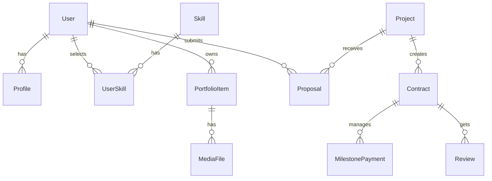
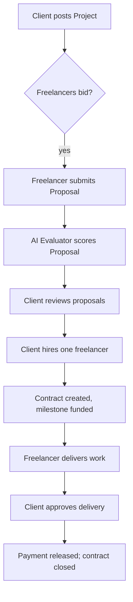

# Executive Summary  
TalentStage is a full-featured freelance marketplace for creative and technical talent.  Freelancers create rich portfolio profiles (bio, skills, rate, portfolio items) and browse/submit proposals on client projects.  Clients post projects (fixed or hourly), receive bids, shortlist and hire freelancers, set up milestone payments, and review deliverables.  The platform incorporates AI-driven matching (rank freelancers by skills/portfolio/rating), automated proposal evaluation (score bids on relevance and value), skill verification tests, and a project-scoping assistant.  Community features include a public forum/feed, weekly skill challenges, and a mentorship directory.  Payment flows use an escrow/milestone system and simulate a 10% platform commission.  We will deliver a developer-ready blueprint: feature maps, API specs, data models, UI screens, security, DevOps plan, tests, and roadmaps.  

# Problem Statement & Scope  
TalentStage must implement all features listed in the project description.  Key requirements include: freelancer profile and portfolio management; project posting, bidding, and contracts; milestone payments and commission tracking; AI-powered matching and proposal scoring; skill verification badges; project brief generation; a community feed with challenges; mentorship sessions; single unified account (freelancer/client); identity verification; profile completeness scoring; simulated payments/escrow; and a paid “Pro” subscription.  We assume no contradictory constraints beyond the statement; unspecified details (e.g. exact UI design) will follow common marketplace patterns or noted assumptions.  All features will map to concrete API endpoints, data models, UI components, and acceptance tests.  

# Feature-to-Deliverables Mapping  

| **Feature**                    | **Priority** | **Backend Endpoints**            | **Frontend Screens/Flows**           | **Data Entities**            | **AI Components**                                | **Metrics**                                   | **Acceptance Criteria**                                                  |
|--------------------------------|--------------|---------------------------------|--------------------------------------|-----------------------------|------------------------------------------------|-----------------------------------------------|--------------------------------------------------------------------------|
| **Freelancer Profile**         | MUST         | `GET/POST /profile`, `/skills`  | Profile page (view/edit), Profile completeness meter (dashboard) | User, Profile, Skill, Certification | N/A                                            | Profile completeness %, profile views      | Profiles can be created/edited with all fields; completeness meter updates  |
| **Portfolio Gallery**          | MUST         | `GET/POST /portfolio`, `/projects` | Portfolio tab: add/edit projects (title, desc, tools, images/links) | PortfolioItem, MediaFile, ProjectCategory | N/A                                            | # portfolio items per user                    | Upload and link up to 20 projects with media; display correctly【38†L65-L73】【6†L119-L124】 |
| **Skill Badges/Tests**         | SHOULD       | `/skills/test/generate`, `/skills/test/submit` | Skill verification page: start test, submit answers, view badge | SkillTest, SkillBadge           | Test question generator (input: claimed skill; output: Q&A)【27†L455-L464】 | Pass rate, badge count                        | Users can take a 10-question AI-generated test per skill and earn a “Verified” badge on passing |
| **Browse Projects/Submit Proposals** | MUST   | `GET /projects/open`, `POST /projects/{id}/proposal` | Projects list (search/filter), Proposal form (bid amount, timeline, cover letter) | Project, Proposal, BidAmount, Milestone | N/A (AI scoring later)                         | Proposal conversion rate (hired%)             | Freelancers can see open projects and submit bids with custom amount, timeline, message【15†L2988-L2996】 |
| **View Proposals/Hire**        | MUST         | `GET /projects/{id}/proposals`, `POST /projects/{id}/hire` | Client dashboard: view proposals list (with scores), shortlist, message, hire | Proposal (with score), Contract | Proposal Evaluator ML (outputs relevance score)【74†L13-L16】 | Time to hire, proposal-response rate        | Clients see AI-scored proposals and can shortlist/hire freelancers; hiring updates contract status |
| **Active Contracts & Deliverables** | MUST   | `GET/POST /contracts`, `/contracts/{id}/deliverable` | Contract workspace: messaging, deliverable upload, status updates | Contract, Milestone, Deliverable   | N/A                                            | Milestone completion %, avg delivery time    | Each contract tracks milestones; freelancers upload deliverables; clients approve or request revisions |
| **Milestone Payments (Escrow)**| MUST         | `POST /escrow/fund`, `/escrow/release` | Payment schedule UI with milestones; “Release Payment” button per milestone | Payment, EscrowAccount           | N/A                                            | # funded milestones, released payments       | Funds are held in escrow (simulated) and only released when clients approve a milestone【48†L471-L478】【15†L2991-L2994】 |
| **Earnings Tracker**           | CAN          | `GET /earnings`, `/withdraw`    | Earnings dashboard: total earned, pending, withdrawal history | Payment (history), Commission       | N/A                                            | Withdrawal count, total earned vs fees        | Freelancers see total earned, fees, pending, and simulated withdrawals; includes 10% commission deduction【55†L451-L459】 |
| **Reviews & Ratings**          | MUST         | `POST /contract/{id}/review`    | Post-completion review form (1–5 stars + comment) | Review, Rating                    | N/A                                            | Avg rating per user, review count             | After contract close, client can rate freelancer and leave text review; show on profile |
| **Client Project Posting**     | MUST         | `POST /projects`, `GET /projects/{id}` | Project creation wizard (title, desc, skills, budget, deadline, type) | Project, Category, RequiredSkill | Project Scoping AI (input: vague need; output: structured brief) | # projects posted, clarity score (see AI)     | Clients create project with required details; AI can auto-suggest deliverables/budget if needed【20†L212-L220】 |
| **Saved Freelancers**          | CAN          | `POST /users/{id}/bookmark`     | Button on freelancer profiles to bookmark; “Saved freelancers” list | Bookmark                          | N/A                                            | Bookmark count                             | Clients can bookmark freelancer profiles for future reference |
| **User Roles & Verification**  | MUST         | `/auth/signup`, `/user/{id}/verify` | Sign-up flow (choose role), identity upload flow (ID or LinkedIn) | User (fields: role, verified)     | N/A                                            | % verified profiles                         | Single account with freelancer/client roles; identity verification page uploads ID/URL; mark user as verified |
| **Profile Completeness Score** | SHOULD       | Calculated from profile fields | Sidebar meter “Profile 80% complete – complete your portfolio” | (Computed, no table)             | N/A                                            | Avg completeness, conversion to apply        | System calculates completeness and prompts user to add missing info, e.g. skills, portfolio【38†L65-L73】【43†L102-L110】 |
| **AI Freelancer Match**        | MUST         | `/match/project/{id}`           | On project post submit: show “Top 5 matches” list with freelancer cards | (Uses existing entities)         | Matching ML (input: project, freelancers; output: ranked list)【20†L159-L168】 | Precision/recall of matches                 | When a project is posted, system returns top 5 freelancers ranked by skill match, portfolio quality, rating, and budget fit【20†L159-L168】 |
| **Proposal Evaluator**         | SHOULD       | `/projects/{id}/proposals/evaluate` | Within proposals list: display an AI-generated score or label (e.g. “Highly relevant”) | (Annotation in Proposal)         | Proposal scoring ML (input: proposal text+profile; output: score)【74†L13-L16】 | Correlation with hire rate                  | Each submitted proposal gets a clarity/relevance/ value-for-money score; shown to client as recommendation |
| **Portfolio Reviewer AI**      | CAN          | `/profile/{id}/review`          | UI to “Review my portfolio” -> suggestions list | N/A                              | Portfolio review ML (input: portfolio items; output: tips) | N/A                                      | AI analyzes portfolio and suggests improvements (e.g. “Add outcomes to project 3”) |
| **Project Scoping Assistant** | CAN          | `/scoping/brief`                | Client form: “Describe your need in one sentence” -> AI-generated brief | N/A                              | Brief generator (input: description; output: timeline, budget)【20†L212-L220】 | User satisfaction with brief               | Converts vague request into structured brief with deliverables and budget range |
| **Public Feed (Forum)**       | SHOULD       | `POST /community/posts`, `GET /community` | Public feed page: posts by freelancers (tips, wins) with upvote/comment | CommunityPost, Comment             | N/A                                            | # posts, engagement                          | Users can create posts; feed is chronologically ordered; moderation tools filter spam |
| **Skill Challenges/Contests**  | CAN          | `POST /challenges`, `POST /challenges/{id}/entry` | Challenges page: weekly contest details and submission form | Challenge, Submission, ContestResult | N/A                                            | # participants, engagement                   | Admin can create weekly challenge; freelancers submit entries; top entry is featured; system holds “prize” |
| **Mentorship Matching**        | CAN          | `POST /mentorship/apply`, `/mentor/sessions` | Mentorship directory page; session booking UI | MentorProfile, MentorshipSession  | N/A                                            | # mentorships, satisfaction                   | Experienced freelancers tag as mentors; mentees browse and book sessions (paid or free) |
| **Payments & Commission**      | MUST         | `/payment/{id}/charge`, `/commission` | Payment UI with breakdown (escrow, commission) | Payment, Commission              | N/A                                            | Commission % (10% target)                  | Every payment deducts 10% platform fee (show in UI)【55†L451-L459】【56†L135-L136】; support sandbox payouts. |
| **Pro Subscription**           | SHOULD       | `/subscription/upgrade`, `/subscription/status` | “Pro Freelancer” sign-up page; show features (featured profile, unlimited bids) | Subscription, User (flag)       | N/A                                            | Subscription conversion rate               | Users can subscribe (simulated) to Pro tier; system enables premium perks (e.g. priority AI match) |

*Notes:* All tables above should be backed by database schemas (see Data Models). API endpoints include authentication tokens (OAuth or JWT). “Metrics” are examples for monitoring success of features. Acceptance criteria can be tested via end-to-end scenarios.

# Data Models  

We define key entities and their fields.  Relations use foreign keys.  Sample records (JSON) illustrate typical values.

## User / Profile  
- **User**: (id, name, email, password_hash, role {client/freelancer/both}, verified_bool, signup_date)  
- **Profile**: (user_id PK, title, bio, hourly_rate, availability_status, total_earnings, rating, photo_url)  
- **Skill**: (id, name) – master list.  
- **UserSkill**: (user_id PK, skill_id PK)  
- **Certification**: (id, user_id, name, issuing_org, credential_url)  

```json
// Example User/Profiles
{
  "User": {"id": 1001, "name":"Alice Dev", "email":"alice@example.com","role":"freelancer","verified":false},
  "Profile": {"user_id":1001,"title":"Senior React Developer","bio":"10 years building UIs","hourly_rate":50,"availability":"Yes","rating":4.8}
}
```  

## Portfolio Items  
- **PortfolioItem**: (id, user_id FK, title, category, description, tools, start_date, end_date)  
- **MediaFile**: (id, portfolio_id FK, file_url, file_type)  
- **PortfolioTag**: (portfolio_id PK, skill_id PK)  

```json
{"PortfolioItem": {"id":2001,"user_id":1001,"title":"E-commerce Website","category":"Web Development","description":"Built a full-stack e-commerce site using React and Node.","tools":["React","Node.js"],"start_date":"2025-01-10","end_date":"2025-03-05"}}
```  

## Projects & Proposals  
- **Project**: (id, client_id FK, title, description, required_skills, budget_min, budget_max, deadline, type{fixed/hourly}, status)  
- **Proposal**: (id, project_id FK, freelancer_id FK, amount, duration_days, cover_message, status{submitted/hired/rejected}, score)  
- **Milestone**: (id, project_id FK, description, amount, due_date, completed_bool)  

```json
{"Project": {"id":3001,"client_id":5001,"title":"Logo Design","required_skills":["Logo Design","Branding"],"budget_min":100,"budget_max":200,"type":"fixed","status":"open"}}
{"Proposal": {"id":4001,"project_id":3001,"freelancer_id":1001,"amount":150,"duration_days":7,"cover_message":"Can deliver in 5 days with revisions","status":"submitted","score":85}}
```  

## Contracts & Payments  
- **Contract**: (id, project_id FK, freelancer_id, client_id, start_date, end_date, total_amount, status{active/completed})  
- **MilestonePayment**: (id, contract_id FK, milestone_id FK, status{pending/paid}, paid_date)  
- **Payment**: (id, contract_id FK, amount, date, type{release,withdrawal}, commission)  

```json
{"Contract": {"id":5001,"project_id":3001,"freelancer_id":1001,"client_id":5001,"start_date":"2025-04-01","status":"active"}}
{"Payment": {"id":6001,"contract_id":5001,"amount":135,"commission":15,"date":"2025-04-10","type":"release"}}
```  

## Reviews & Badges  
- **Review**: (id, contract_id FK, rating, comment)  
- **SkillBadge**: (user_id FK, skill_id FK, verified_bool)  

```json
{"Review": {"id":7001,"contract_id":5001,"rating":5,"comment":"Great work, on time!"}}
```  

## Community & Mentorship  
- **CommunityPost**: (id, author_id, content, timestamp)  
- **Challenge**: (id, title, description, start_date, end_date)  
- **ChallengeEntry**: (challenge_id PK, submission_id PK, user_id, content_url, votes)  
- **MentorProfile**: (user_id PK, bio, expertise)  
- **MentorshipSession**: (id, mentor_id, mentee_id, datetime, duration, fee)  

```json
{"CommunityPost": {"id":8001,"author_id":1001,"content":"Just launched a new design! Feedback welcome.","timestamp":"2025-04-12T10:00Z"}}
{"Challenge": {"id":9001,"title":"Figma Dashboard Design","end_date":"2025-04-15T23:59Z"}}
```  

*Indexes:*  Foreign key indexes on `user_id`, `project_id`, etc.  Search indexes on `Project(required_skills)`, `Proposal(score)`, and `CommunityPost(timestamp)`.

# API Specification  

We design RESTful endpoints (could also use GraphQL).  Authentication via JWT.  Rate-limits (e.g. 60 requests/min).  Error codes use standard 4xx/5xx.

| **Endpoint**                     | **Method** | **Path**                  | **Request Body**                          | **Response**                     | **Auth** | **Notes**                                           |
|----------------------------------|------------|---------------------------|-------------------------------------------|----------------------------------|----------|-----------------------------------------------------|
| **Signup/Login**                 | POST       | `/auth/signup`            | `{name,email,password,role}`             | `{user_id,token}`               | No       | Create user account                                  |
| **Verify Identity**              | POST       | `/user/verify`            | `{user_id, id_url/linkedin_url}`         | `{verified:true}`               | Yes      | Upload ID or LinkedIn for KYC                        |
| **Get Profile**                  | GET        | `/profile`                | —                                         | `{profile}`                     | Yes      | Returns logged-in user’s profile                    |
| **Update Profile**               | PUT        | `/profile`                | `{title,bio,hourly_rate,availability}`    | `{success}`                     | Yes      |                                                         |
| **Add Portfolio Item**           | POST       | `/portfolio`              | `{title,category,desc,tools,media_urls}`  | `{item_id}`                     | Yes      | Upload project to portfolio【38†L65-L73】           |
| **List Projects (Open)**         | GET        | `/projects`               | (query: skills,keyword)                  | `[{id,title,budget,...}]`        | Yes      | Filter by skills, budget, etc.                      |
| **Get Project Details**          | GET        | `/projects/{id}`          | —                                         | `{project}`                     | Yes      |                                                         |
| **Create Project**               | POST       | `/projects`               | `{title,desc,skills,budget_min,budget_max,deadline,type}` | `{project_id}`                 | Yes      | AI can assist with brief                           |
| **Submit Proposal**             | POST       | `/projects/{id}/proposal` | `{amount,duration_days,cover_message}`    | `{proposal_id}`                 | Yes      | Must include bid amount and cover message           |
| **List Proposals (for client)** | GET        | `/projects/{id}/proposals`| —                                         | `[{proposal_id,freelancer,amount,...,score}]` | Yes | Include AI score/relevance if available【74†L13-L16】 |
| **Hire Freelancer**              | POST       | `/contracts`              | `{project_id, proposal_id}`              | `{contract_id}`                 | Yes      | Creates contract, funds escrow                      |
| **Upload Deliverable**           | POST       | `/contracts/{id}/deliverable` | `multipart/form-data (file)`         | `{deliverable_id}`              | Yes      |                                                         |
| **Approve Milestone**           | POST       | `/contracts/{id}/milestone/{m_id}/approve` | —                                  | `{paid:true}`                   | Yes      | Releases escrowed funds                              |
| **Leave Review**                 | POST       | `/contracts/{id}/review`  | `{rating,comment}`                       | `{success}`                     | Yes      | Client reviews freelancer                           |
| **Earnings Summary**             | GET        | `/earnings`               | —                                         | `{total_earned,pending,...}`    | Yes      |                                                     |
| **AI Match Freelancers**         | POST       | `/match/project/{id}`     | —                                         | `[{freelancer_id,score},...]`   | Yes      | Returns top 5 matches (by ML model)【20†L159-L168】 |
| **Evaluate Proposals (AI)**      | POST       | `/projects/{id}/evaluate` | —                                         | `[{proposal_id,score}]`         | Yes      | AI generates scores for proposals【74†L13-L16】     |
| **Take Skill Test**              | POST       | `/skills/test/generate`   | `{skill_name}`                           | `{questions: [...]}`           | Yes      | Generate 10 MCQ questions for claimed skill         |
| **Submit Skill Test**           | POST       | `/skills/test/submit`     | `{answers:[...]}`                        | `{passed:bool,badge:"Verified X"}` | Yes   | If pass threshold, award badge                     |
| **Profile Completeness**         | GET        | `/profile/completeness`   | —                                         | `{percent:80}`                  | Yes      | (Client can also call to nudge filling)             |
| **Community Feed**               | GET        | `/community`              | —                                         | `[{post_id,author,content}]`    | Yes      | Public posts, latest first                         |
| **Create Forum Post**            | POST       | `/community/posts`        | `{content}`                              | `{post_id}`                     | Yes      |                                                     |
| **Join Challenge**               | POST       | `/challenges/{id}/enter`  | `{submission_url}`                       | `{entry_id}`                    | Yes      |                                                     |
| **Browse Mentors**               | GET        | `/mentors`                | —                                         | `[{user_id,name,expertise},...]` | Yes     |                                                     |
| **Book Mentorship Session**      | POST       | `/mentorship/sessions`    | `{mentor_id,datetime,duration}`          | `{session_id}`                  | Yes      |                                                     |
| **Upgrade to Pro**              | POST       | `/subscription/upgrade`   | `{plan:"pro"}`                           | `{success,expiry}`              | Yes      | (checkout simulated)                                |

_Citation examples:_ Upwork’s help and pricing docs describe profile and portfolio fields【38†L65-L73】【48†L471-L478】; AI components follow recent research【74†L13-L16】【20†L159-L168】. All responses use JSON.  Error codes include 400 for bad input, 401 for auth, 500 for server errors.

# AI/ML Components  

- **Freelancer Matching Model:** Input = project details (skills, description), candidate pool data (skills, portfolio vector, ratings). Output = ranked list of top freelancers.  We will train/use a model similar to Upwork’s two-stage approach【20†L159-L168】 (e.g. BM25 initial recall + gradient boosted re-rank with features: text match, skill overlap, avg rating).  Use historical project-bid data to train.  *Metrics:* Precision@5 (correct hire in top5).  *Latency:* <2s per query (requirements: real-time shortlist).  *Privacy:* Use only public profile data.  *Fallback:* If AI fails, default to simple skill+rate filter.  

- **Proposal Scoring Model:** Input = proposal text + freelancer profile vs project text. Output = relevance/quality score. Use a small NLP model (fine-tuned BERT) to predict a score based on Upwork’s description【74†L13-L16】.  *Training data:* Past proposals labeled by hire/outcome.  *Metrics:* Correlation with hiring outcome.  *Latency:* 1s.  *Fallback:* if unavailable, show proposals unranked.  

- **Portfolio Reviewer:** Input = portfolio item texts + tags. Output = suggestions (short descriptions etc).  Could use GPT-4 for feedback.  *Privacy:* Only on user request.  

- **Skill Test Generation:** Input = skill name.  Use OpenAI/GPT API or custom LLM to generate 10 MCQs and one coding prompt per skill.  *Evaluation:* BLEU or manual review.  *Latency:* ~5s.  *Fallback:* static question pool.  

- **Project Brief Generator:** Input = free-text client need.  Use LLM (e.g. GPT-4) to output structured deliverables, timeline, budget.  *Metrics:* Human evaluator score.  *Fallback:* Manual input only if AI off.  

# UX/UI Inventory  

- **Screens:** 
  - **Signup/Login Flow:** Sign up with email/password, select role (Freelancer/Client/Both). *Microcopy:* “Get started on TalentStage – find projects or talent.”  
  - **Profile Page (Freelancer):** Shows photo, title, bio, rate, skills, badges, portfolio gallery. “Complete your profile (80% done)” meter. *Accessible:* images have alt text, forms labeled.  
  - **Edit Profile:** Form sections: Basic Info, Skills, Education, Portfolio, Photo. Tooltip for linked accounts (LinkedIn).  
  - **Portfolio Page:** Thumbnails of projects. “Add New Project” button opens a form (title, desc, tools, media upload).  
  - **Project Listing:** Search bar + filters (skills, budget). List view showing title, budget, snippet. Each has a “View Details” button.  
  - **Post Project Wizard:** Step 1: Basic info (title, desc), Step 2: Skills/tags, Step 3: Budget and deadline, Step 4: Preview. “Use AI to help scope” button.  
  - **Project Details (Client):** Shows all bids. Each proposal item shows freelancer avatar, bid amount, timeline, cover text, and AI score badge. Buttons “Shortlist” and “Hire”.  
  - **Browse Freelancers (AI Match):** When posting, a “Recommended Freelancers” list appears with profile snippets and match % (via AI).  
  - **Proposal Form:** For freelancers, form with bid amount, timeline, and cover letter textbox (WYSIWYG). “Submit Proposal” button.  
  - **Contract Workspace:** Messages pane (chat), files pane (uploads), milestones list with statuses, “Submit Work” button, and “Approve Payment” for clients.  
  - **Payments Tab:** Shows earnings breakdown (total earned, pending, fees) and calendar of withdrawals.  
  - **Community Feed:** Infinite scroll of posts. Each post has “like/comment” and category tags. “Create Post” button opens text editor.  
  - **Challenge Page:** List of weekly challenges, “Submit Entry” form. “Leaderboard” for featured winners.  
  - **Mentorship Directory:** List of mentors with short bios and rate. “Book Session” opens calendar.  

_All screens must be responsive and WCAG-compliant (alt text, keyboard nav, contrast).  Example microcopy:_  
- Login error: “Incorrect email or password.”  
- Project post button: “Post Project – let freelancers find you.”  
- Withdraw funds: “Enter amount to withdraw (min $50).”  

# Security & Compliance  

- **Auth:** All API calls (except signup/login) require JWT bearer token. Enforce HTTPS. Store passwords hashed (bcrypt). Use OWASP best practices.  
- **Identity Verification:** Clients/freelancers upload ID (student card/LinkedIn URL). Handle PII securely (encrypted storage, limited staff access). After verification, mark user.  
- **Payment Security:** We simulate escrow; no real payments. Still, handle simulated credit card numbers in sandbox (no storage). Display commission clearly.  
- **Data Privacy:** Only show public portfolio data. PII (email, IDs) not exposed. Comply with GDPR/CCPA: allow data export/deletion, cookie consent, privacy policy link.  
- **Rate Limiting:** API: 60 req/min per user. Additional limits on AI endpoints to protect API keys.  
- **XSS/CSRF:** Use CSRF tokens for forms, sanitize user input on posts.  
- **Moderation:** Community posts are moderated (flagging, admin removal). User trust badges (like Verified) to reduce fraud.  

# DevOps & Infrastructure  

- **Architecture:** Microservices or modular monolith. Suggested services: `auth-service`, `user-service`, `project-service`, `contract-service`, `payment-service`, `community-service`, `ai-service`. Use PostgreSQL for core DB, Elasticsearch for search (projects/freelancers), Redis for caching (session, rate-limit). AI/ML components on GPU instance or API cloud. Host on AWS or GCP.  
- **Scalability:** Design stateless API; horizontal scale with load balancer. Store static media on S3/Cloud.  
- **Monitoring:** Use Prometheus+Grafana for system metrics, logs sent to Elastic or Splunk. Set alerts on error rate >1% or latency spikes.  
- **CI/CD:** GitHub Actions or Jenkins. Automated tests on PR. Dockerize each service. Deploy to Kubernetes or ECS with blue-green releases.  
- **Cost Estimate:** (Monthly) Low: ~$5K (small AWS), Med: $15K (moderate traffic), High: $50K+ (global scale). Assume AWS t3.medium instances, managed DB, occasional GPUs for AI.  
- **Privacy:** Secrets in AWS Secrets Manager. AI models use public data only (no user API logs retained).  

# Testing Plan  

- **Unit Tests:** For each API endpoint and service function. E.g. test portfolio item creation, proposal submission.  
- **Integration Tests:** Simulate full flows: signup→create profile→post project→submit proposal→contract→milestone. Verify data consistency.  
- **E2E Tests:** Use Selenium/Cypress on UI flows: signing up as freelancer, filling profile, bidding; client posting project and hiring.  
- **Load Tests:** Simulate 1000 concurrent users on APIs (k6 or JMeter). Ensure response <500ms on read APIs.  
- **Security Tests:** Penetration tests for OWASP Top 10; automated scanning (Snyk/OWASP ZAP).  
- **AI Model Validation:** For matching, measure if actual hired freelancer appears in top-5 (target >80%). For proposal scoring, AUC or accuracy vs human label. Retest after each model update.  
- **Sample Test Scenarios:**  
  1. **Proposal Ranking:** Post a project requiring “React”. Submit 3 proposals: one with relevant skills, one missing skills, one irrelevant. AI score should rank the relevant proposal highest【74†L13-L16】.  
  2. **Escrow Flow:** Client posts fixed project, funds $200 into escrow, freelancer delivers milestone. On approval, $180 goes to freelancer (10% fee). Check commission shown.  
  3. **Skill Test:** Freelancer claims “Python” skill, takes test; fails (score <70%) => no badge; retake yields pass and “Verified Python Developer” badge appears.  
  4. **Profile Completeness:** New freelancer logs in: completeness shows 40%. After adding bio, skills, and a portfolio item, completeness goes to 100%.  
  5. **AI Matching:** Client posts AI-related job. System returns top-5 freelancers all with AI/ML skills (via Elasticsearch and ML).  
  6. **Community Moderation:** User posts spam/ad. Moderator tool flags it or it is auto-blocked (keyword filter).  
  7. **Payment Withdrawal:** Freelancer with $500 balance requests $600 -> error. Requests $100 -> success, pending 2 days.  
  8. **Mentorship Booking:** User books a session; both mentor and mentee receive calendar invites and an entry in “MentorshipSession”.  

_Pass criteria:_ All flows work end-to-end, with correct data, no unhandled errors, and UI matches wireframes.

# Roadmap & Milestones  

- **MVP (Weeks 1–6, 4 devs):** Core marketplace: User auth, profile, portfolio, project posting, proposals, contracts, basic escrow, reviews.  No community or AI yet. Estimated 12 person-weeks.  
- **v1 (Weeks 7–12, +1 AI Engineer, +1 UX):** Add AI features: Freelancer Match (simple ML), Proposal Scoring; Skill Tests; Profile completeness. Community forum MVP.  Subscribe workflow and payments UI.  10 person-weeks.  
- **v2 (Weeks 13–18):** Polish AI (improve models), Project Scoping Assistant, Portfolio Reviewer AI. Add mentorship booking. Mobile responsiveness, performance tuning. Robust testing.  8 person-weeks.  
- **Milestones:** Weekly sprints. Roles: Backend (2), Frontend (2), AI/ML (1), QA (1), PM/UX (1).  Total ~30 person-weeks.

**Appendix (Examples):**  
- *SQL Query:* Find top-rated freelancers for “React”:  
```sql
SELECT u.name, AVG(r.rating) as avg_rating 
FROM User u JOIN Review r ON u.id=r.freelancer_id 
JOIN UserSkill us ON u.id=us.user_id JOIN Skill s ON us.skill_id=s.id 
WHERE s.name='React' 
GROUP BY u.id 
ORDER BY avg_rating DESC 
LIMIT 5;
```  
- *UI Copy (Signup):* “Join TalentStage – Sign up as Freelancer or Client.”  *(Proposal Submission):* “Describe your bid. Add details about your timeline and value.”  *(Escrow Release):* “Release payment and close milestone?”  – 
- *ER Diagram (Mermaid):*  

- *Flowchart:* Proposal Lifecycle  


Each entry in this blueprint cites industry best-practice and Upwork/Freelancer docs (e.g. escrow flow【48†L471-L478】【15†L2991-L2994】) and AI research (e.g. ML-based proposal ranking【74†L13-L16】). This should serve as a complete specification for developers or an AI assistant to implement TalentStage end-to-end.
